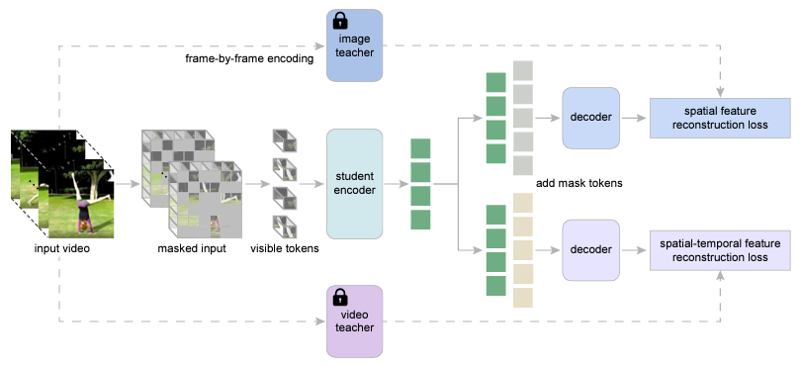
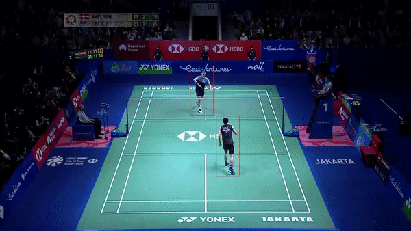
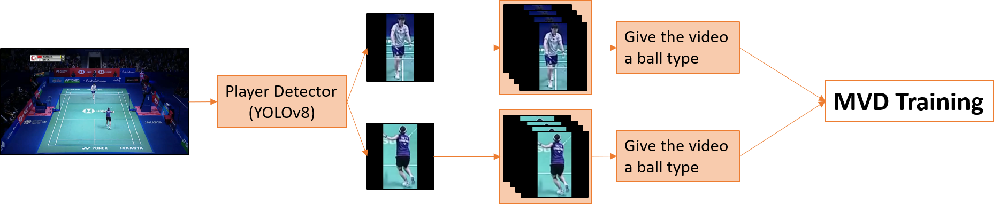
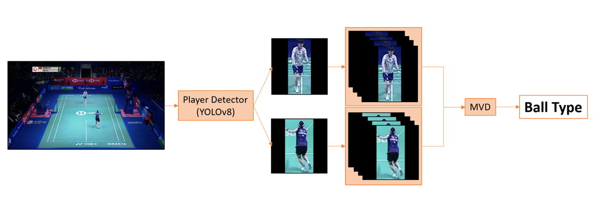

# 2023 AICUP Badminton Detection - Ball Type Recognition

- [**[AICUP 2023] Shuttlecock Recognization**](https://aidea-web.tw/topic/cbea66cc-a993-4be8-933d-1aa9779001f8)  
## Introduction

A PyTorch implementation of ball type recognition based on the [MVD](https://github.com/ruiwang2021/mvd) and [YOLOv8](https://github.com/ultralytics/ultralytics). Thanks to the contributors of these great codebases.


## Experimentals Results



## Installation

Assuming a fresh Anaconda distribution with Python 3.8, you can install the dependencies with:

```sh
cd MVD_ball_type_recognition
pip install -r requirements.txt
```

## Data Preparation

Get each video clip and its csv file:
```sh
python video_data_preprocessing.py
python video_data_delete_zero.py
```

## Training workflow


### Pre-training

```sh
scripts\mvd_vit_small_from_vit_base_teacher_epoch_400\pretrain_mvd_small_on_custom.bat
```

### Fine-tuning with pre-trained models

```sh
scripts\mvd_vit_small_from_vit_base_teacher_epoch_400\finetune_on_custom.bat
```

## Inference workflow


### Inference

```sh
scripts\mvd_vit_small_from_vit_base_teacher_epoch_400\vis.bat
```

## References

+ https://github.com/ruiwang2021/mvd

+ https://github.com/ultralytics/ultralytics
